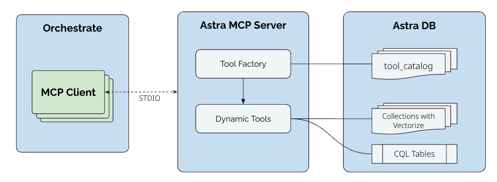
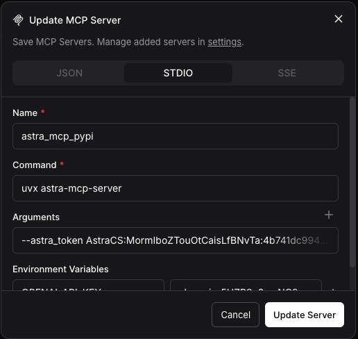
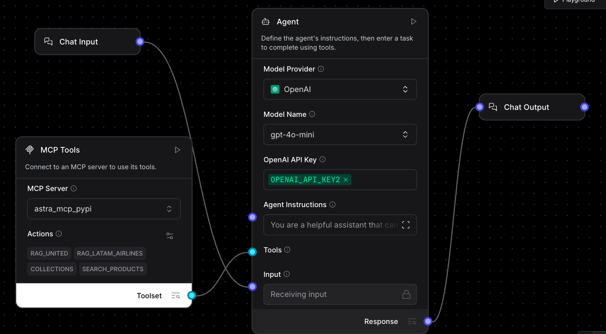
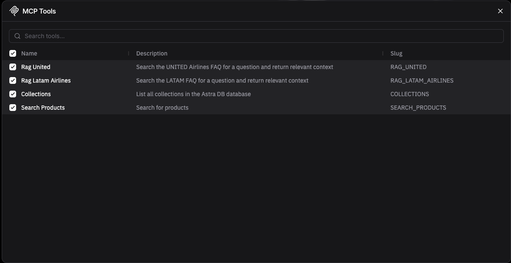
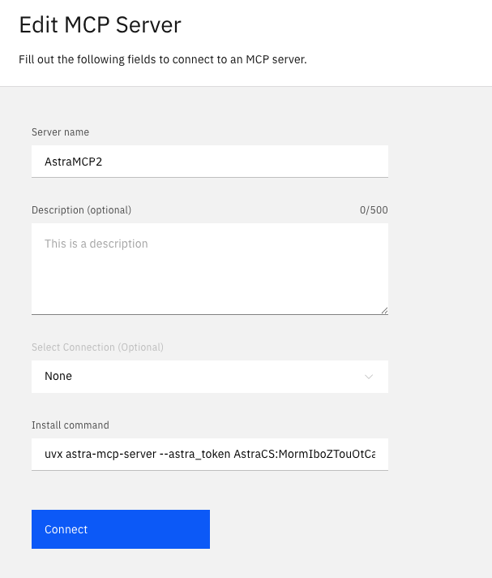
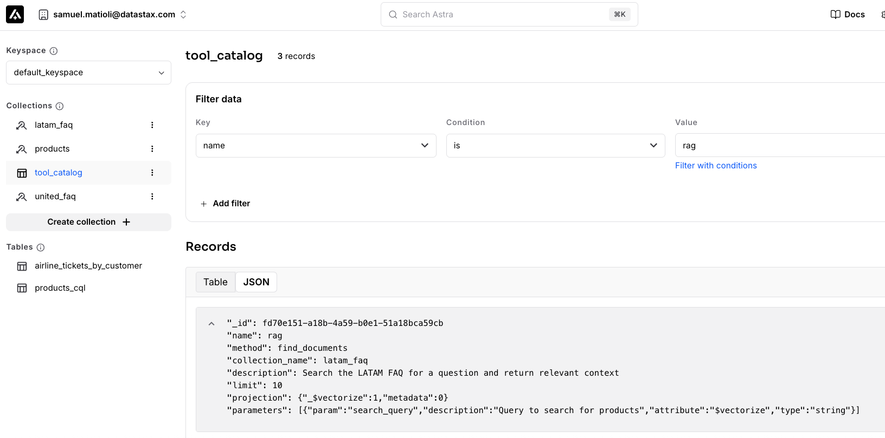

# Astra MCP Server

A Model Context Protocol (MCP) server for interacting with Astra DB (DataStax Astra).



The astra-mcp-server that provides tools to interact with Astra DB. It is built with FastMCP and Astrapy (then Astra DB or DataStax HCD can be used as database).

The server will load the tool definitions from a collection in Astra DB or a file. The tool definitions are then transformed to a function definition that can be passed to an LLM, making it possible to use the tools provided by the MCP Server in an Agentic workflow.

When a tool is called, the server will call the appropriate method in Astra DB or DataStax HCD, converting the parameters to the appropriate filters and return the result to the MCP Client/Agent. If some embedding generations is required, the models from OpenAI or IBM Watsonx can be used for similarity search.

## How to run the Astra MCP Server

### Running it as MCP Server with STDIO

To run the astra-mcp-server as MCP Server with STDIO, you can use the following command:

```bash
uvx astra-mcp-server --astra_token <astra_token> --astra_endpoint <astra_endpoint>
```

### Running it as MCP Server with Langflow

To access the tools provided by astra-mcp-server as MCP Server with Langflow, you can add an MCP Server with the following configuration:



After adding the MCP Server, you can connect it to an Agent component:



The tool names and descriptions are loaded from the catalog collection in Astra DB.



### Running it as MCP Server with IBM Orchestrate

To access the tools provided by astra-mcp-server as MCP Server with IBM Orchestrate, you can add an MCP Server with the following configuration:



### Running it as MCP Server with HTTP locally

To run the astra-mcp-server as MCP Server with STDIO, you can use the following command:

```bash
uvx astra-mcp-server -tr http
```
If you have an .env file, the varriables will be considered while running the server. Otherwise, you can pass arguments to the server. Check the App options below for more details.

# App options

- `--transport <transport>`: The transport to use for the MCP Server. Valid values are `stdio` and `http`. Default is `stdio`.
- `--astra_token <astra_token>`: The Astra token to use for the Astra DB connection. If not filled, the app will try to get the token from the `ASTRA_DB_APPLICATION_TOKEN` environment variable.
- `--astra_endpoint <astra_endpoint>`: The Astra endpoint to use for the Astra DB connection. If not filled, the app will try to get the endpoint from the `ASTRA_DB_API_ENDPOINT` environment variable.
- `--tags <tags>`: The tags to filter the tools for the MCP Server. 

## Catalog options
- `--catalog_file <catalog_file>`: The catalog file to use for the MCP Server. Default is `tools_config.json`. If not filled, the app will try to get the catalog from the `ASTRA_DB_CATALOG_COLLECTION` environment variable.
- `--catalog_collection <catalog_collection>`: The catalog collection to use for the MCP Server. Default is `tool_catalog`. If not filled, the app will try to get the catalog from the `ASTRA_DB_CATALOG_COLLECTION` environment variable.

Options valid for the HTTP transport:

When running the app as HTTP, you can use the following options:
- `--host <host>`: The host to use for the MCP Server. Default is `127.0.0.1`.
- `--port <port>`: The port to use for the MCP Server. Default is `8000`.
- `--workers <workers>`: The number of worker processes to use for the MCP Server. Default is `1`.
- `--log-level <log_level>`: The log level to use for the MCP Server. Valid values are `debug`, `info`, `warning`, and `error`. Default is `info`.
- `--log-file <log_file>`: The log file to use for the MCP Server. Default is `logs/astra_mcp_server.log`.
    

## 1. Set up environment variables

If you are running the app with some MCP Client that allows you to define environment variables, you can set the same variables in the MCP Client.

If you prefer, you can create a `.env` file in app directory with the following variables:

```env
# Astra DB Configuration
ASTRA_DB_APPLICATION_TOKEN=your_astra_db_token
ASTRA_DB_API_ENDPOINT=your_astra_db_endpoint
ASTRA_DB_CATALOG_COLLECTION=tool_catalog
LOG_LEVEL=DEBUG
LOG_FILE=./logs/logs.log
# Logging Configuration (optional)
LOG_LEVEL=INFO
LOG_FILE=logs/astra_mcp_server.log

#Embedding and Agentic Tool Generation Configuration
OPENAI_API_KEY=your_openai_api_key
OPENAI_BASE_URL=your_openai_base_url
IBM_WATSONX_API_KEY=your_ibm_watsonx_api_key
IBM_WATSONX_BASE_URL=your_ibm_watsonx_base_url
IBM_WATSONX_PROJECT_ID=your_ibm_watsonx_project_id
```

# The Tool Catalog

The tool catalog is the collection of tools that the MCP Server will provide to the MCP Clients/Agents. It can be save to a file or to a Astra DB collection (preferable for production use cases).

Check the examples in the `examples/tools` directory for more details.

The tools are created based on a json specification that needs the following fields:
```json
{
        "tags": ["products"], // The tags of the tool - Filter if needed
        "type": "tool", // The type of the tool
        "name": "search_products", // The name of the tool
        "description": "Search for products", // The description of the tool to the MCP Client
        "limit": 10, // The limit of the tool
        "method": "find_documents", // The method to use to execute the tool
        "collection_name": "products", // The collection to use to execute the tool
        "table_name": "products", // The table to use to execute the tool (if the collection_name is not filled)
        "projection": {"$vectorize": 1, "metadata": 0}, // The projection of the tool
        "parameters": [ // The parameters of the tool
            {  
                "param": "search_query", // The name of the parameter
                "description": "Query to search for products", // The description of the parameter
                "attribute": "$vectorize", // The attribute of the parameter... or $vectorize
                "type": "string", // The type of the parameter
                "required": 1, // Whether the parameter is required
                "operator": "$eq", // The operator to use to filter the parameter - if not filled, the operator is $eq
                "expr": "date(departure_time) > date('today')", // The expression to use to filter the parameter - if not filled, the expression is not applied
                "enum": ["baggage", "boarding", "check-in", "flight-status", "other"], // The enum of the parameter
                "embedding_model": "text-embedding-3-small", // The embedding model to use to generate the embedding
                "info": "indexed column" // The information about the parameter - indexed column, partition key, sorting key, vector column, etc.
            },
            {  
                "param": "in_stock", // The name of the parameter 
                "value": true, // The value of the parameter - IF FILLED, THE PARAMETER IS NOT SENT TO THE MCP CLIENT and applied by the server
                "attribute": "in_stock" // The attribute of the parameter
            }
        ],

    }
```

Save the json document to the file or to the Astra DB collection. When the server is started, it will load the tools from the file or the Astra DB collection.

After storing on Astra DB, the tools will appear in the Astra DB collection like this:



## Updating tools

To update the tools, you can update the json document and save it to the file or to the Astra DB collection.

```bash
# Upload a catalog file to Astra DB
uv run astra-mcp-catalog -f tools_config_example.json -t tool_catalog

# Upload with custom table name
uv run astra-mcp-catalog -f my_tools.json -t my_tool_catalog

# Get help
uv run astra-mcp-catalog --help

```

# Agentic Tool Generation

The astra-mcp-server includes a tool specification generator that can automatically create tool configurations by analyzing your Astra DB tables. This is particularly useful when you have existing data and want to quickly generate MCP tools for it.

## Prerequisites

- Set the `ASTRA_DB_APPLICATION_TOKEN` environment variable
- Set the `OPENAI_API_KEY` environment variable
- Access to the Astra DB database and table you want to analyze

## Usage

```bash
# Generate tool specification for a table
uv run astra-mcp-tool-agent --table-name <table_name> --keyspace-name <keyspace_name> --db-name <db_name> --out-file <json file name> -ai "tool should be used only for future flights, so add a parameter for departure date > today" -pf <prompt file path>
```

## Command Options

- `--export-prompt` / `-ep`: Export the prompt used to generate the tool specification
- `--table-name` / `-t`: Name of the table to analyze (required)
- `--collection-name` / `-c`: Name of the collection to analyze (required)
- `--keyspace-name` / `-k`: Name of the keyspace to analyze (default: `default_keyspace`)
- `--db-name` / `-d`: Name of the database containing the table (required)  
- `--out-file` / `-o`: Output file path for the generated JSON (required) - If not filled, the tool specification will be printed to the console
- `--sample-size` / `-s`: Number of sample records to analyze (default: 5)
- `--additional-instructions` / `-ai`: Additional instructions for the tool specification generation
- `--prompt-file` / `-pf`: Prompt file to use for the tool specification generation

## What it does

1. **Connects to Astra DB** using your existing credentials
2. **Retrieves table schema** and analyzes the structure
3. **Samples data** (first 5 records by default) to understand field types
4. **Generates parameters** automatically based on actual table fields
5. **Creates tool specification** in the exact format required by the MCP server
6. **Outputs JSON** ready to use with your MCP server

```

### Integration with Existing Workflow

After generating a tool specification, you can:

1. **Review and customize** the generated JSON as needed
2. **Upload to Astra DB** using the catalog tool:
   ```bash
   uv run astra-mcp-catalog -f user_tool.json -t tool_catalog
   ```
# Local Development

```bash
# Install dependencies
uv sync

# Run the server
uv run astra-mcp-server --host 127.0.0.1 --port 5150 --reload --log-level debug
```

### Alternative: Direct uvicorn (for development)

```bash
# Run directly with uvicorn
uv run uvicorn server:main --factory --reload --port 5150 --log-level debug
```


## Using MCP Inspector (STDIO)

```bash
npx @modelcontextprotocol/inspector uv run astra-mcp-server --log-level debug -tr stdio
```

